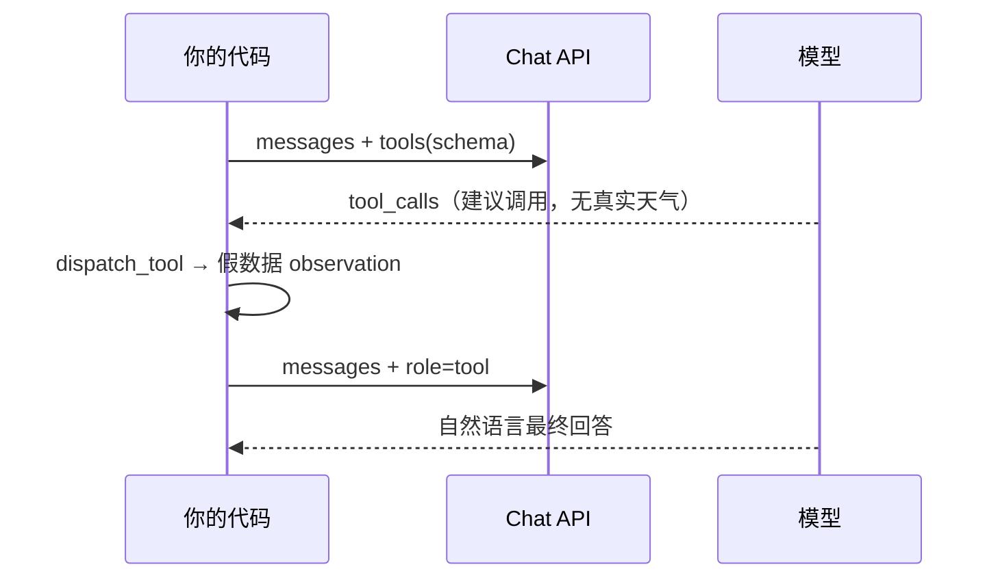

# Day 5-7：Function Calling

## 背景 / 学习目标

- 跑通 `function_calling_demo.py` 的「两轮请求」完整链路。
- 理解：模型**不会**执行 Python 函数，只根据 `tools` schema 输出 `tool_calls`。
- 能解释 `tool_calls` 里的 `name` / `arguments` 从哪来。

## 今日操作

```bash
cd ../code
.venv/bin/python function_calling_demo.py
```

对照源码看：第 1 轮 `tool_calls` → `dispatch_tool` → `role: tool` → 第 2 轮最终回答。

## 核心概念

### 模型怎么知道输出 `tool_calls` 这种格式？

**不是因为模型「看见」了你的 `def get_weather`**，而是因为：

1. 请求里传了 `tools=TOOLS`（JSON Schema 说明书）。
2. API 协议约定：有 `tools` 时，assistant 可以返回 `tool_calls`（含 `id`、`function.name`、`function.arguments`）。
3. 模型在训练/对齐里学过：需要查天气时 → 填表（选工具名 + 填参数 JSON），而不是瞎编气温。

终端里的 `ChatCompletionMessageFunctionToolCall(...)` 是 **SDK 解析 HTTP 响应**，不是模型在执行 Python。

### `TOOLS` 里写了什么，模型就知道什么

```python
TOOLS = [{
    "type": "function",
    "function": {
        "name": "get_weather",
        "description": "查询指定城市的当前天气",
        "parameters": {
            "properties": {"city": {"type": "string", ...}},
            "required": ["city"],
        },
    },
}]
```

| 来源 | 模型知道什么 |
| --- | --- |
| `name` | 只能调用你列在 `tools` 里的名字 |
| `parameters` | 参数名、类型、是否必填（schema） |
| `description` | **是否调用、何时调用**的主要依据 |
| 用户话 | 参数**值**（如「北京」→ `{"city":"北京"}`） |

Python 里的 `get_weather(city: str)` 与 schema **不会自动同步**，`name` / 字段名要自己对齐；真正执行靠 `dispatch_tool` 做桥梁。

### 两轮请求在干什么



- **第 1 轮**：模型输出「我想调 `get_weather`，参数是这样」；此时还不知道 25°C。
- **第 2 轮**：你把工具返回值以 `role: tool` 塞回后，模型才根据 observation 组织人话。

### 易混淆点

| 误解 | 事实 |
| --- | --- |
| 模型会调用我的函数 | 只输出结构化 JSON；执行在 `for call in msg.tool_calls` 里 |
| 模型知道函数返回值 | 第一轮不知道；返回值是你 append 的 `tool` 消息 |
| `arguments` 是模型随便编的 | 应在 schema 约束下填槽；写错 schema 会导致对不上 `dispatch_tool` |

## 自测（参考答案）

### 1. LLM 调用工具的本质是什么？

LLM **不会真调工具**。它根据 `tools` 定义和用户问题，输出一段结构化信息（`tool_calls`），由你的代码解析 JSON、执行函数，再把结果塞回 `messages`。

### 2. 第 1 轮结束后，`messages` 里大致有哪些 role？

`system`、`user`、带 `tool_calls` 的 `assistant`（无或少量 `content`）、若干条 `tool`（每段 observation 一条）。

### 3. 为什么第 2 轮还要传 `tools=`？

让模型仍知道有哪些工具可用（部分实现/习惯）；本轮通常直接根据 observation 生成最终 `content`，不再调工具。

## 小结

**背一句**：Function Calling = 你把工具菜单（schema）交给模型；模型填表（`tool_calls`）；你按表执行真函数，把结果当 observation 喂回去。

`description` 写清楚，和改 system prompt 一样重要——这是模型决定「调不调、调哪个」的主要依据。
