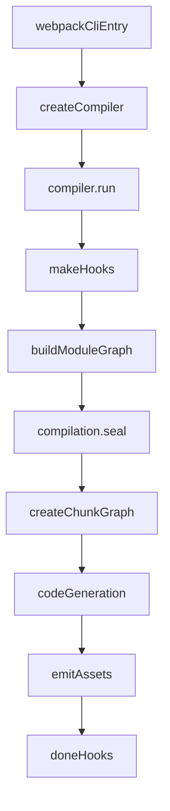

# Week6：Webpack 源码主链阅读笔记

## 阅读目标
- 建立从 CLI 启动到产物输出的完整心智模型。
- 明确 Compiler / Compilation 的分工。
- 能将常见配置项映射到源码中的执行位置。

## 主流程图

## 推荐阅读主线（按顺序）
1. `webpack-cli` 中的命令入口，确认参数如何进入 webpack 核心。
2. `lib/webpack.js`：创建 compiler 的入口逻辑。
3. `lib/Compiler.js`：`run` / `compile` / `emitAssets` 主链。
4. `lib/Compilation.js`：模块收集、依赖解析、seal 阶段。
5. `lib/ChunkGraph.js`：模块与 chunk 的映射关系。
6. `lib/NormalModule.js`：loader 管道与模块构建流程。

## 关键类职责
- `Compiler`：一次完整构建任务的调度者，管理生命周期 hooks。
- `Compilation`：本轮构建的上下文，负责模块、chunk、asset 的组织。
- `NormalModuleFactory`：将请求解析为具体模块对象。
- `NormalModule`：执行 loader、解析依赖、生成中间结果。
- `ChunkGraph`：维护 chunk 与 module 的关联，影响分包结果。

## 配置到源码的映射示例
- `entry` -> 进入 `Compiler` 的 make 阶段并初始化依赖图。
- `module.rules` -> 在 `NormalModule` 构建时触发 loader 执行链。
- `optimization.splitChunks` -> 在 `seal` 后 chunk 优化阶段生效。
- `plugins` -> 通过 hooks 注入 `Compiler/Compilation` 生命周期。

## 本周输出模板
可按以下结构写你自己的最终复盘：
- 构建主链时序图（1 张）
- 关键类职责表（1 张）
- 配置与源码映射清单（至少 10 条）
- 3 个你在项目中会立即应用的优化点
